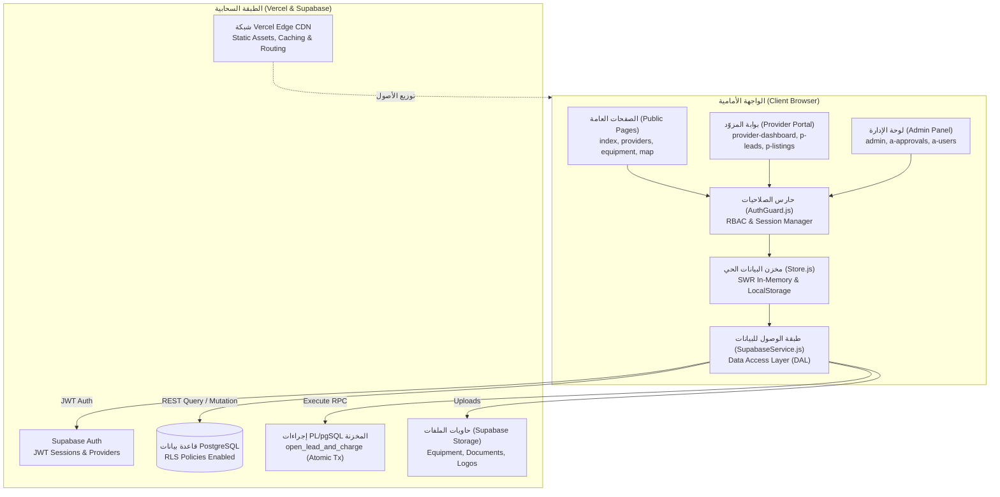
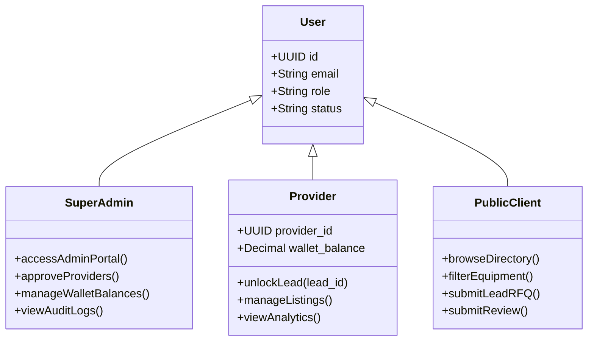
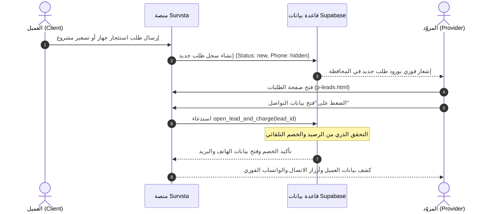

# دليل العمليات والتشغيل الفني لمنصة سورفستا
# Survsta Platform — Enterprise Operations Manual & Technical Runbook

> **الإصدار:** 2.3 Production Ready  
> **تاريخ التحديث:** سبتمبر 2026  
> **الجهة:** الفريق الهندسي — منصة Survsta الرقمية  
> **الموقع المباشر:** [Survsta Platform](https://geo-station-app.vercel.app)

---

## 1. بنية النظام ومجموعة التقنيات (System Architecture & Tech Stack)

تعتمد منصة **Survsta** على معمارية هجينة وخفيفة فائقة السرعة (**High-Performance Hybrid Architecture**) تجمع بين كفاءة الواجهات الأمامية بدون أطر عمل ثقيلة (**Vanilla Enterprise Stack**) وقوة قواعد البيانات السحابية العلائقية مع أنظمة الأمان على مستوى الصفوف (**Supabase PostgreSQL + RLS**).

### أ. الهيكل التكنولوجي الأساسي (Technology Stack)

| الطبقة | التقنية المستخدمة | الوظيفة والدور |
| :--- | :--- | :--- |
| **Frontend Framework** | Vanilla JavaScript (ES6+ Modules) | أداء فائق، انعدام تام لأخطاء الـ Hydration، وزمن تحميل صفري للحزم البرمجية |
| **Design System & Styling** | CSS3 Custom Properties (Design Tokens) | نظام تصميم موحد بملفات tokens.css و style.css و portal.css يدعم RTL/LTR والسمات المتباينة |
| **State & Cache Management** | Custom SWR In-Memory + LocalStorage Store | نمط Stale-While-Revalidate لتوفير واجهات فورية التفاعل (0ms latency) مع مزامنة خلفية |
| **Spatial / Maps Engine** | Leaflet.js (v1.9.4) + OpenStreetMap | خرائط تفاعلية لتحديد مواقع المكاتب ومراكز الأجهزة وحساب النطاقات الجغرافية |
| **Backend & Database** | Supabase (PostgreSQL 15+) | قاعدة بيانات علائقية كاملة، تدعم المعاملات الذرية (ACID Transactions) والامتدادات المكانية |
| **Security & Authorization** | PostgreSQL Row-Level Security (RLS) + RBAC | عزل بيانات كل مزود تلقائياً على مستوى المحرك، مع حراسة مسارات عبر authGuard.js |
| **Monetization Engine** | Stored Procedures / PLpgSQL RPC | دالة ذرية open_lead_and_charge لتطبيق نموذج Pay-Per-Lead عبر محافظ المزودين |
| **Cloud Hosting & CDN** | Vercel Edge Network | استضافة سحابية موزعة عالمياً للملفات الساكنة مع توزيع فوري عبر الـ CDN |

---

### ب. مخطط المعمارية الهندسية وتدفق البيانات (Architecture Diagram)



---

## 2. خريطة الهيكل التنظيمي للمشروع (Directory Structure Map)

تم تنظيم المشروع بدقة ليفصل بين بيئة العرض السحابية، المخططات الهندسية، والبيانات التجريبية:

```text
d:\geo_station web site├── SURVSTA_OPERATIONS_MANUAL.md     # دليل العمليات والتشغيل الفني الحالي
├── vercel.json                      # تكوين النشر السحابي لـ Vercel
├── supabase_rls_and_triggers.sql    # سكريبتات الـ SQL لسياسات الأمان والدوال والمحفظة
├── geo_station_schema.dbml          # المخطط الهيكلي الكامل لقاعدة البيانات (DBML)
│
├── All images/                      # مكتبة الصور الهندسية المعتمدة عالية الدقة
│   └── (41 صورة منتقاة بعناية للأجهزة والمواقع والمكاتب الهندسية)
│
├── uploads/                         # نماذج أولية سابقة للعرض (Prototypes)
│   ├── index.html                   # صفحة عرض سابقة
│   └── GeoStation_عرض_العميل_...   # ملف العرض التقديمي للعملاء
│
└── geo-station-site/                # المجلد الإنتاجي الفعلي (Root للموقع المنشور)
    ├── assets/                      # أصول التصميم والبرمجة
    │   ├── css/
    │   │   ├── tokens.css           # متغيرات التصميم: الألوان، الخطوط، الظلال، وحماية التباين
    │   │   ├── font.css             # خط Cairo مدمج بصيغة Base64 WOFF2 للعمل أوفلاين
    │   │   ├── style.css            # التنسيقات الرئيسية للموقع العام والبطاقات
    │   │   └── portal.css           # تنسيقات لوحات الإدارة وبوابات المزوّدين
    │   ├── js/
    │   │   ├── data.js              # البيانات البذرية الأولية (Providers, Equipment, Services)
    │   │   ├── store.js             # مدير الحالة العام بنمط SWR والمزامنة السحابية
    │   │   ├── supabaseService.js   # طبقة الاتصال بقاعدة بيانات Supabase و Auth و Storage
    │   │   ├── authGuard.js         # محرك فحص الصلاحيات وعزل بوابات الأدمن والمزوّدين
    │   │   ├── portal.js            # شل الواجهات الجانبية والهيدر للبوابات الداخلية
    │   │   ├── crud.js              # واجهات التحكم بالنماذج والجداول للمدير والمزوّد
    │   │   ├── app.js               # تفاعلات الموقع العام، الفلاتر، وبناء البطاقات
    │   │   └── i18n.js              # محرك الترجمة ودعم اللغتين العربية والإنجليزية
    │   └── img/
    │       ├── survsta-logo.svg     # الشعار الرسمي الفاتح للمنصة
    │       ├── survsta-logo-dark.svg# الشعار المخصص للخلفيات الفاتحة وشاشات الدخول
    │       └── *.jpg                # الصور المخصصة للبطاقات والـ Hero Section
    │
    ├── (الصفحات العامة - Public Pages):
    │   ├── index.html               # الصفحة الرئيسية للمنصة
    │   ├── providers.html           # دليل مكاتب وشركات المساحة
    │   ├── provider.html            # ملف المكتب / الشركة التفصيلي
    │   ├── equipment.html           # سوق الأجهزة المساحية (بيع وإيجار)
    │   ├── equipment-detail.html    # تفاصيل الجهاز المساحي وطلب الاستئجار/الشراء
    │   ├── services.html            # دليل الخدمات الهندسية والميدانية
    │   ├── service.html             # صفحة تفاصيل الخدمة
    │   ├── map.html                 # الخريطة الجغرافية التفاعلية
    │   ├── jobs.html / job.html     # وظائف قطاع المساحة وتفاصيل الوظيفة
    │   ├── academy.html/course.html # الأكاديمية والدورات (مقفلة مؤقتاً بحالة "قريباً")
    │   ├── join.html                # نموذج انضمام شركاء الخدمة والمكاتب
    │   ├── login.html/register.html # بوابات تسجيل الدخول وإنشاء الحساب
    │   ├── about.html/contact.html  # من نحن وصفحة التواصل
    │   ├── how-it-works.html        # كيف تعمل المنصة للعملاء والشركات
    │   ├── mobile-app.html          # صفحة تطبيق الهاتف المحمول
    │   ├── privacy.html/terms.html  # سياسة الخصوصية والشروط والأحكام
    │   └── help.html / directory.html# مركز المساعدة والدليل الشامل
    │
    ├── (بوابة المزوّد - Provider Portal p-*.html):
    │   ├── provider/dashboard         # لوحة القيادة والمؤشرات الرقمية للمكتب
    │   ├── p-leads.html             # صندوق الوارد للطلبات وفتح بيانات العملاء
    │   ├── p-listings.html          # إدارة الأجهزة المعروضة للإيجار والبيع
    │   ├── p-services.html          # الخدمات المساحية المقدمة وأسعارها
    │   ├── p-profile.html           # الملف التجاري، التراخيص، وبيانات الاتصال
    │   ├── p-locations.html         # الفروع والنطاق الجغرافي للتغطية
    │   ├── p-team.html              # إدارة المهندسين والمساحين التابعين للمكتب
    │   ├── p-analytics.html         # تقارير المشاهدات ومعدلات التحويل
    │   ├── p-jobs.html              # إدارة إعلانات التوظيف التابعة للجهة
    │   ├── p-reviews.html           # تقييمات العملاء والرد عليها
    │   ├── p-ads.html               # خيارات الرعاية والإعلانات المميزة
    │   ├── p-notifications.html     # مركز الإشعارات الفورية
    │   └── p-settings.html          # إعدادات الحساب والمحفظة وكلمة المرور
    │
    └── (لوحة الإدارة العليا - Super Admin Portal a-*.html):
        ├── admin (dashboard)         # مؤشرات المنصة الشاملة وحجم التداول
        ├── a-analytics.html         # تحليلات النمو الإقليمي وتوزيع الطلبات
        ├── a-approvals.html         # مركز مراجعة واعتماد المكاتب والأجهزة الجديدة
        ├── a-equipment.html         # المراجعة الفنية للأجهزة والمواصفات
        ├── a-verification.html      # توثيق السجلات التجارية والمؤهلات الهندسية
        ├── a-reviews.html           # الرقابة على تقييمات العملاء واعتمادها
        ├── a-reports.html           # إدارة بلاغات المستخدمين والنزاعات
        ├── a-providers.html         # الإدارة المركزية لبيانات المكاتب
        ├── a-clients.html           # سجل العملاء وأصحاب المشروعات
        ├── a-users.html             # إدارة حسابات المستخدمين وصلاحيات المشرفين
        ├── a-content.html           # إدارة مقالات ومحتوى المنصة
        ├── a-media.html             # مكتبة الوسائط المركزية
        ├── a-jobs.html              # المراقبة على عروض التوظيف المنشورة
        ├── a-data.html              # أداة فحص سلامة البيانات المجمعة
        ├── a-import.html            # استيراد وتصدير البيانات بصيغة CSV/JSON
        ├── a-leads.html             # الإشراف المالي على حركة الطلبات
        ├── a-audit.html             # سجل التدقيق الأمني (Security Audit Log)
        └── a-settings.html          # إعدادات النظام، أسعار الليد، وعمولات المنصة
```

---

## 3. دليل إدارة وتحديث البيانات (Data Management Guide)

يعمل مخزن البيانات عبر ثلاث طبقات متناسقة تحقق مرونة كاملة للمشغل:

### أ. الطبقات الثلاث للبيانات (Data Hierarchy)

1. **البيانات الأولية (Seed Data):**  
   موجودة داخل `assets/js/data.js` (للمكاتب، الأجهزة، والخدمات) و `assets/js/store.js` (للعملاء، الطلبات، والمستخدمين). تُستخدم لملء المنصة بالبيانات فوراً في حالة عدم اتصال المتصفح بالإنترنت أو عدم ربط Supabase.
2. **المخزن المحلي السريع (LocalStorage SWR Store):**  
   يتم حفظ البيانات تحت المفتاح `SURVSTA_DB_v2`. عند تشغيل أي صفحة، تُقرأ البيانات من هذا المخزن في زمن **0ms**، وتُعرض الواجهات فوراً.
3. **قاعدة البيانات السحابية (Supabase PostgreSQL):**  
   تتصل بها المنصة عبر `assets/js/supabaseService.js`. أي عملية إضافة أو تعديل أو حذف تُنفذ محلياً ثم تُرسل سحابياً في الخلفية.

---

### ب. كيفية إضافة مكتب مساحي جديد (Provider)

#### الطريقة الأولى: من خلال لوحة الإدارة (`a-providers.html`)
1. ادخل إلى الرابط: `https://geo-station-app.vercel.app/a-providers.html`
2. اضغط على زر **"إضافة مزوّد جديد"**.
3. املأ الحقول الإلزامية:
   * **الاسم:** اسم المكتب أو الشركة (مثال: "مكتب القاهرة للاستشارات المساحية").
   * **النوع:** اختر بين (مكتب مساحة، شركة مساحة، مركز معايرة، مركز تدريب، وكيل توريدات).
   * **المحافظة والمدينة:** (مثال: القاهرة • التجمع الخامس).
   * **بيانات الاتصال:** الهاتف، البريد الإلكتروني، ورقم الواتساب.
   * **التخصصات:** حدد مجالات العمل (رفع مساحي، مسح ليزري 3D، تأجير، بيع، معايرة).
4. اضغط **"حفظ واعتماد"**. سيظهر المكتب فوراً في صفحة `providers.html` والخريطة `map.html`.

#### الطريقة الثانية: عبر ملف الأكواد `assets/js/data.js`
أضف كائن المزود داخل مصفوفة `PROVIDERS`:
```javascript
{
  id: 11,
  slug: "cairo-survey-consult",
  name: "مكتب القاهرة للاستشارات المساحية",
  nameEn: "Cairo Survey Consult",
  type: "مكتب مساحة",
  gov: "القاهرة",
  city: "التجمع الخامس",
  badge: "موثّق",
  plan: "pro",
  rating: 4.9,
  reviewsCount: 14,
  phone: "01001234999",
  wa: "201001234999",
  email: "info@cairo-survey.example",
  lat: 30.0131,
  lng: 31.4989,
  img: "assets/img/office-cad-workstation.jpg",
  services: ["رفع طوبوغرافي", "حساب كميات", "أعمال As-Built", "نظام BIM"],
  equipment: ["Total Station Leica TS16", "GNSS Trimble R12i"],
  verified: true
}
```

---

### ج. كيفية إضافة جهاز مساحي جديد (Equipment)

#### الطريقة المباشرة: من لوحة تحكم المزوّد (`p-listings.html`)
1. يفتح المزوّد صفحته الخاصة بالأجهزة.
2. يضغط **"إضافة جهاز جديد"**.
3. يحدد:
   * **عنوان الجهاز والموديل:** (مثال: `Total Station Leica TS16 - 1"`).
   * **النوع والفئة:** (Total Station / GNSS RTK / Digital Level / 3D Scanner).
   * **نوع العرض:** (للإيجار اليومي/الشهري، أو للبيع جديد/مستعمل).
   * **السعر المقدر:** (مثال: `1,200 ج.م / يوم`).
   * **المحافظة وحالة الجهاز:** (معاير حديثاً، مرفق الشهادة).
4. رفع صورة الجهاز، ثم الضغط على **"إرسال للاعتماد"**.

---

## 4. مصفوفة الصلاحيات وتدفق المستخدمين (User Roles & Flows)

تعتمد المنصة محرك تدقيق للصلاحيات داخل ملف authGuard.js يفصل بين ثلاث فئات رئيسية من المستخدمين:



### أ. تدفق فتح الليد وخصم الرصيد (Pay-Per-Lead Flow)

يعتبر هذا التدفق هو جوهر النموذج التجاري الرقمي لمنصة **Survsta**:
1. يدخل العميل لطلب جهاز أو خدمة أو تسعير مشروع من صفحة مزود أو جهاز.
2. ينشئ النظام سجلاً جديداً في جدول `leads` بحالة `status = 'new'` ويُخفي رقم هاتف وبريد العميل عن المزوّد وتظهر شارة **"طلب مغلق — يتطلب فتح"**.
3. يدخل المزوّد إلى صفحة صندوق الطلبات (`p-leads.html`) ويضغط **"فتح بيانات التواصل"**.
4. يستدعي النظام دالة الـ RPC السحابية المكتوبة بـ PostgreSQL: `open_lead_and_charge(p_lead_id)`.
5. تقوم قاعدة البيانات بإجراء ذري مشفر:
   * التحقق من أن المزوّد هو صاحب الطلب أو Super Admin.
   * التحقق من كفاية رصيد المحفظة (`wallet_balance >= fee_amount`).
   * خصم التكلفة من المحفظة وتوليد سجل مالي في جدول `wallet_transactions`.
   * تحديث حالة الطلب إلى `opened` وإرجاع بيانات الهاتف والواتساب والبريد كاملة للمزوّد.



---

## 5. دليل النشر والعمليات والصيانة (Deployment & DevOps Guide)

### أ. متطلبات بيئة العمل (Prerequisites)
* **Node.js:** الإصدار 18.x أو أعلى (للتشغيل والـ CLI).
* **Git:** الإصدار 2.30+ لإدارة المستودعات.
* **Vercel CLI:** أداة النشر الرسمية (`npm i -g vercel` أو استخدام `npx vercel`).
* **حساب Supabase:** مشروع مفعل مع إعداد قواعد الجداول.

---

### ب. النشر إلى Vercel (Production Deployment Workflow)

يتم النشر السحابي في منصة Survsta عبر خطوتين بسيطتين:

#### الخطوة 1: دفع التحديثات إلى المستودع الرئيسي (GitHub)
```bash
# 1. التحقق من حالة الملفات
git status

# 2. إضافة كافة التعديلات
git add .

# 3. إنشاء Commit احترافي يوضح التغييرات
git commit -m "feat: your descriptive commit message"

# 4. الرفع إلى فرع main
git push origin main
```

#### الخطوة 2: النشر المباشر والفوري للإنتاج (Vercel CLI)
يتم تنفيذ الأمر التالي من المجلد الرئيسي للمشروع:
```bash
npx vercel --prod --yes
```
* **ملف التكوين:** يقرأ Vercel تلقائياً ملف `vercel.json` الذي يحدد مجلد الإخراج:
  ```json
  {
    "cleanUrls": true,
    "outputDirectory": "geo-station-site"
  }
  ```
* بمجرد انتهاء الرفع، تظهر رسالة التأكيد برابط النشر الرسمي وحالة `READY` (HTTP 200).

---

### ج. تفعيل الاتصال بقاعدة بيانات Supabase (Production Activation)

عند الرغبة في الانتقال من وضع المحاكاة الداخلي (Offline/Demo Fallback) إلى بيئة الإنتاج السحابية الحية:
1. افتح مشروعك في لوحة تحكم Supabase.
2. انسخ **Project URL** و **Project API anon / public key** من: `Settings` > `API`
3. افتح الملف: `assets/js/supabaseService.js`.
4. ضع القيم في الأسطر 15 و 16:
   ```javascript
   const SUPABASE_URL = "https://your-project-id.supabase.co";
   const SUPABASE_ANON_KEY = "eyJhbGciOiJIUzI1NiIsInR5cCI6IkpXVCJ9...";
   ```
5. افتح محرر SQL في Supabase والصق محتويات الملف `supabase_rls_and_triggers.sql` ونفذ الاستعلام لتجهيز الجداول وسياسات الـ RLS ودوال المحفظة بنقرة واحدة.

---

### د. إعداد النطاق المخصص (Custom Domain Setup)
لربط منصة Survsta بنطاق رسمي (مثل `survsta.com` أو `app.survsta.com`):
1. في لوحة تحكم Vercel: ادخل إلى المشروع > `Settings` > `Domains`.
2. أدخل اسم النطاق `survsta.com` و `www.survsta.com`.
3. قم بتحديث سجلات الـ DNS لدى مزود النطاق (Cloudflare / GoDaddy / Namecheap):
   * **A Record:** `@` يوجه إلى `76.76.21.21`
   * **CNAME Record:** `www` يوجه إلى `cname.vercel-dns.com`
4. يقوم Vercel تلقائياً بإصدار وتجديد شهادة الأمان SSL/TLS المجانية عبر Let's Encrypt.

---

### هـ. دليل استكشاف الأعطال الشائعة وحلها (Troubleshooting Runbook)

| العَرَض / المشكلة | السبب المحتمل | الحل العلاجي السريع |
| :--- | :--- | :--- |
| **عدم ظهور التنسيقات الحديثة في المتصفح** | احتفاظ المتصفح بذاكرة التخزين المؤقت (Cache) | تم اعتماد Cache Buster (`?v=2.3`). إذا استمرت المشكلة، اضغط Ctrl + Shift + R للتحديث الإجباري |
| **ظهور شارة Fallback Mode في وحدة التحكم (Console)** | عدم تعيين مفاتيح Supabase في supabaseService.js | النظام مصمم للعمل بسلاسة عبر LocalStorage افتراضياً. أضف المفاتيح السحابية لتفعيل المزامنة المباشرة |
| **إعادة توجيه مفاجئة إلى صفحة الدخول (login.html)** | محاولة الدخول إلى صفحة p-*.html أو a-*.html بعد تسجيل خروج صريح | سجل الدخول بالحساب التجريبي أو أنشئ حساباً بصلاحية provider أو admin |
| **عدم ظهور الخريطة في map.html** | بطء استجابة خوادم OpenStreetMap للـ Tiles | تأكد من الاتصال بالإنترنت، حيث يتم استدعاء مكتبة Leaflet وسيرفر البلاطات الجغرافية من CDN موثوق |

---

> **ملاحظة سرية ومسؤولية قانونية:**  
> هذا الدليل الفني مخصص لفرق العمليات الهندسية والإدارة التقنية لمنصة Survsta. يمنع مشاركة مفاتيح قواعد البيانات الحساسة أو بيانات الخدمة المشفرة خارج القنوات الآمنة للمنصة.
